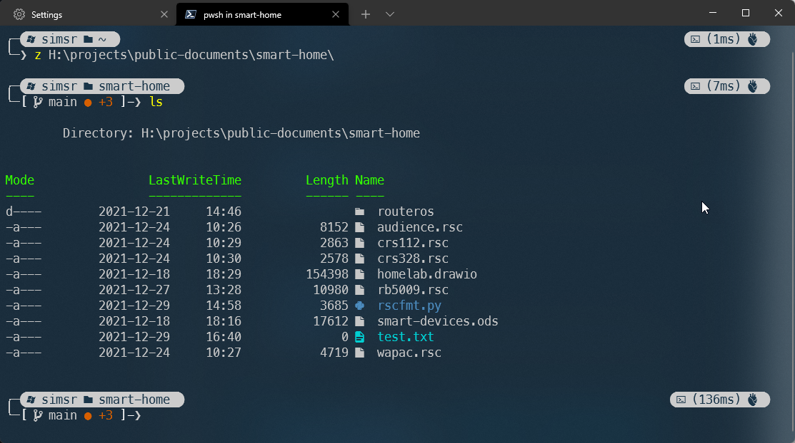

# Simple - An Oh My Posh theme for Powershell



## Installation

1. Install required modules

   1. `Install-Module posh-git -Scope CurrentUser`
   2. `Install-Module oh-my-posh -Scope CurrentUser`
   3. `Update-Module -Name oh-my-posh -AllowPrerelease -Scope CurrentUser`

2. Install a [Nerd Font](https://www.nerdfonts.com/font-downloads) and configure your terminal to use the installed Nerd Font

3. Download `Simple.omp.json` to your `$HOME` directory.

4. Create or edit your powershell profile ($PROFILE) and add these lines:

```powershell
Import-Module posh-git
Import-Module oh-my-posh
Set-PoshPrompt -Theme  ~/simple.omp.json
```

5. Restart your terminal
